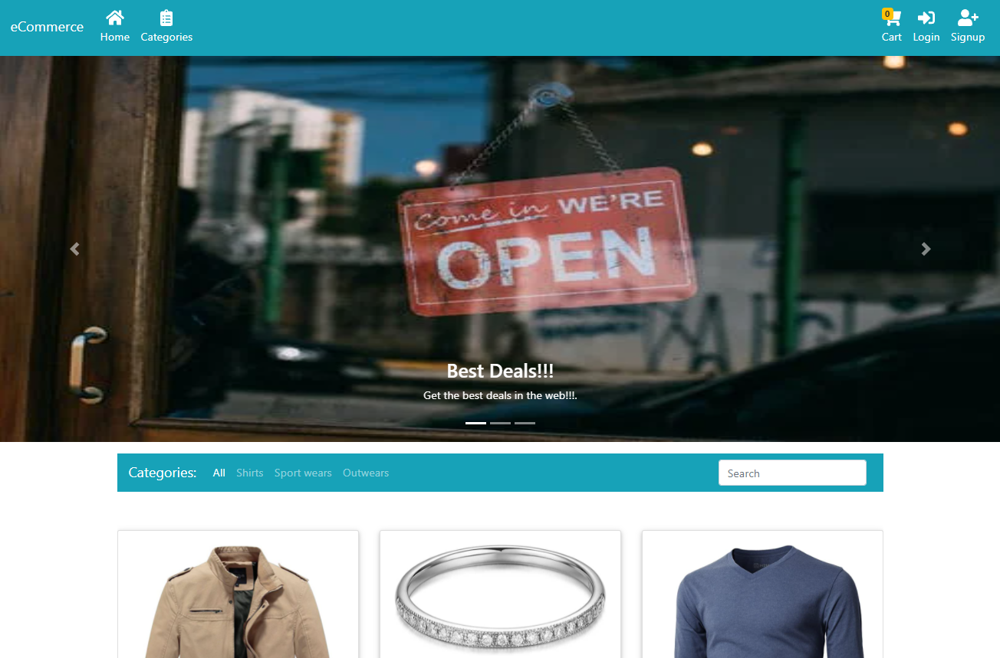

<!--
This README would normally document whatever steps are necessary to get the
application up and running.

Things you may want to c<!--
*** Thanks for checking out this README Template. If you have a suggestion that would
*** make this better, please fork the repo and create a pull request or simply open
*** an issue with the tag "enhancement".
*** Thanks again! Now go create something AMAZING! :D
-->

<!-- PROJECT SHIELDS -->
<!--
*** I'm using markdown "reference style" links for readability.
*** Reference links are enclosed in brackets [ ] instead of parentheses ( ).
*** See the bottom of this document for the declaration of the reference variables
*** for contributors-url, forks-url, etc. This is an optional, concise syntax you may use.
*** https://www.markdownguide.org/basic-syntax/#reference-style-links
-->
[![Contributors][contributors-shield]][contributors-url] 
[![Forks][forks-shield]][forks-url] 
[![Stargazers][stars-shield]][stars-url] 
[![Issues][issues-shield]][issues-url] 
 

# eCommerce-MERN

>  A eCommerce website where guests or logged in customers can add items to cart and checkout. Built with MERN stack and Redux.

Additional description about the project and its features.

Dashboard:



## Built With

- MONGODB
- EXPRESS JS
- REACT
- NODE JS
- REDUX
- REACT-BOOTSTRAP
- JSONWEBTOKEN
- EXPRESS-VALIDATOR
- MULTER
- BCRYPT
- HELMET
- REACT INFINITE SCROLL COMPONENT
- AXIOS
- ESLINT
- GITHUB ACTIONS
- VSCODE

## Getting Started
### Usage
To have this app on your pc, you need to:
* [download](https://github.com/javitocor/ecommerce-MERN/archive/main.zip) or clone this repo:
  - Clone with SSH:
  ```
    git@github.com:javitocor/ecommerce-MERN.git
  ```
  - Clone with HTTPS
  ```
    https://github.com/javitocor/ecommerce-MERN.git
  ```

* In the project directory, you can run:

Install dependencies in your home folder with:

``` bash
   npm install
```

Go to the './frontend' folder and install the frontend dependencies:
```
  npm install
```

And then:
```
  npm run build
```
Back to the home folder, run the server:

``` bash
   npm run devstart
```
Access the page by typing in your web browser

``` bash
   http://127.0.0.1:8000/
```

You can also run the app bY running the server in one port and react in another, like so:
on the project root, run:
```
npm run devstart
```
on the frontend folder, run:
```
npm start
```
You can access the app by typing http://localhost:3000 in the browser.

## Information about the project
### Basic Info
This project wants to be a basic template to build a eCommerce website with authentication and authorizations. 
The backend is based in Nodejs and Expressjs using Mongoose as a database. Most routes are protected, so users need a JWT token to access some pages, but allows guest users to access and create orders. You need to be an admin to perform the most critical operations as delete or update products or roles.
The frontend is built with React&Redux using react route dom to perform navigation and some extra libraries, like react-bootstrap, for de UI.
### Endpoints
All CRUD operations to manage Customers, Products, Orders, Categories, Shipping Addresses, OrderItems and Roles. As an example:
```
  Register
    post http://localhost:8000/api/auth/signup 
  Login
    post http://localhost:8000/api/auth/login 
  Logout
    get http://localhost:8000/api/auth/logout 
  Get all products
    get http://localhost:8000/api/products/ 
  Get product detail
    get http://localhost:8000/api/products/:id 
  Update product
    put http://localhost:8000/api/products/:id 
  Delete product
    delete http://localhost:8000/api/products/:id  
```
You can check all the routes and permissions needed in the [routes folder](./routes/)
### Roles based
There are 3 different type of Roles, Guest, Basic and Admin. Guest user will be the one not loggedin. When a user signup, by default, will be a Basic role. Roles basic and Admin are create first time you connect with MongoDb database.
### Get JWT token
Once a user signs up, needs to login. In the response after login, the user will get a JWT token that will need to add in the headers request, as 'x-access-token', to access the protected routes using Postman or cURL. 
Anyway, react will store the user token in localStorage and from there will be uploaded to redux initial state, so a normal user will not need to worry about. LocalStorage is deleted every logout. In future updates, the token will be send via HttpOnly for safety reasons.
### Seed database
In case you want to take a look on how the website looks with data, you can run ```npm run seed```, and automatically will get 20 different products.
### Cart Cookie
The cart information is saved in a browser cookie, this allows access to the user's cart after logout, close the browser or access the web days after. Also allows a guest user make operations in the website. The cart cookie is removed after checkout.

## Future Features
- Send cookies via HttpOnly
- Add admin panel
- Add avatar field to customers

## Author

👤 Javier Oriol Correas Sanchez Cuesta 
- Github: [@javitocor](https://github.com/javitocor) 
- Twitter: [@JavierCorreas4](https://twitter.com/JavierCorreas4) 
- Linkedin: [Javier Oriol Correas Sanchez Cuesta](https://www.linkedin.com/in/javier-correas-sanchez-cuesta-15289482/) 

## 🤝 Contributing

Contributions, issues and feature requests are welcome!

Feel free to check the [issues page](https://github.com/javitocor/ecommerce-MERN/issues).

## Show your support

Give a ⭐️ if you like this project!

## Acknowledgments 🚀

- [Express Docs](https://expressjs.com/)
- [React Docs](https://reactjs.org/docs/getting-started.html)
- [Redux Docs](https://redux.js.org/)
- [React Bootstrap Docs](https://react-bootstrap.github.io/)
- [Multer Docs](https://github.com/expressjs/multer)
- [Express Validator Docs](https://express-validator.github.io/)
- [Mongoose Docs](https://mongoosejs.com/)
- [API to seed database](https://fakestoreapi.com/products)

## 📝 License

This project is [MIT](lic.url) licensed.

<!-- MARKDOWN LINKS & IMAGES -->
<!-- https://www.markdownguide.org/basic-syntax/#reference-style-links -->
[contributors-shield]: https://img.shields.io/github/contributors/javitocor/ecommerce-MERN.svg?style=flat-square
[contributors-url]: https://github.com/javitocor/ecommerce-MERN/graphs/contributors
[forks-shield]: https://img.shields.io/github/forks/javitocor/ecommerce-MERN.svg?style=flat-square
[forks-url]: https://github.com/javitocor/ecommerce-MERN/network/members
[stars-shield]: https://img.shields.io/github/stars/javitocor/ecommerce-MERN.svg?style=flat-square
[stars-url]: https://github.com/javitocor/ecommerce-MERN/stargazers
[issues-shield]: https://img.shields.io/github/issues/javitocor/ecommerce-MERN.svg?style=flat-square
[issues-url]: https://github.com/javitocor/ecommerce-MERN/issuesover:
